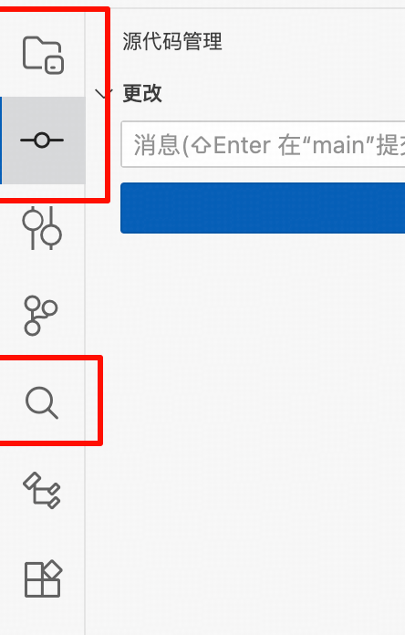
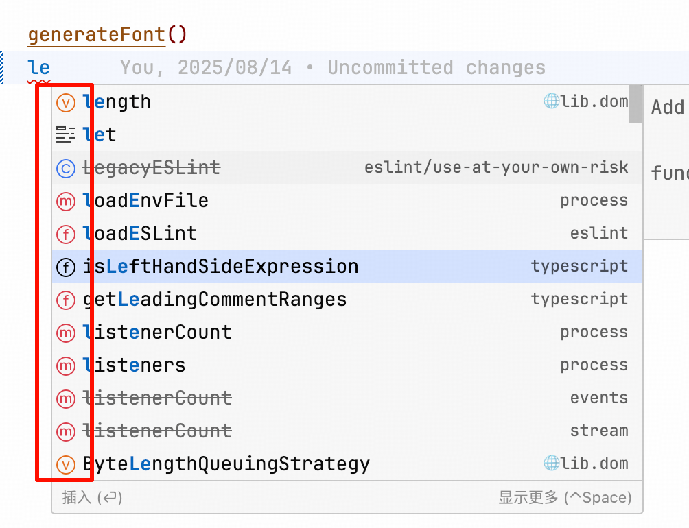

# Product Icon Theme

<div style="display: flex; gap: 10px; align-items: flex-start;">
  
  
</div>

To get the same color as jetBrains, add the following configuration to settings.json

```json
"workbench.colorCustomizations": {
  "symbolIcon.variableForeground": "#E56D17",
  "symbolIcon.constantForeground": "#E56D17",
  "symbolIcon.functionForeground": "#DB3B4B",
  "symbolIcon.methodForeground": "#DB3B4B",
  "symbolIcon.propertyForeground": "#834DF0",
  "symbolIcon.fieldForeground": "#834DF0",
  "symbolIcon.enumeratorMemberForeground": "#834DF0",
  "symbolIcon.interfaceForeground": "#208A3C",
  "symbolIcon.classForeground": "#3574F0",
  "symbolIcon.enumeratorForeground": "#3574F0",
  "symbolIcon.moduleForeground": "#3574F0",
  "symbolIcon.namespaceForeground": "#3574F0"
}
```
