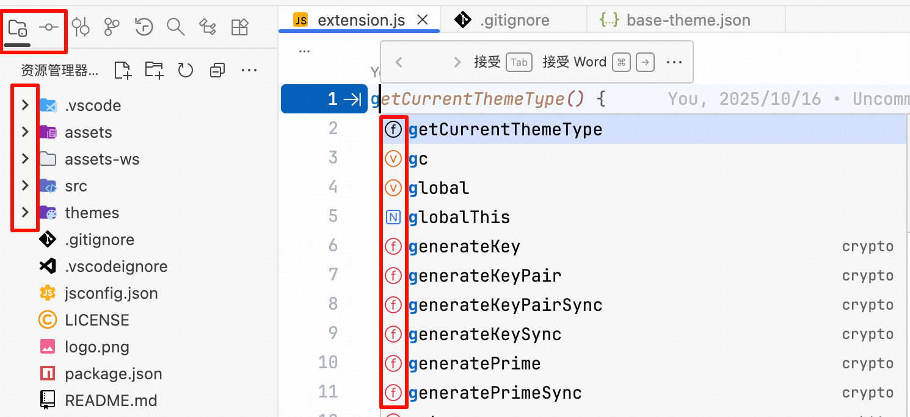

# Product Icon Theme


<!-- <div style="display: flex; gap: 10px; align-items: flex-start;">
  
  
</div> -->

# To get the same color as jetBrains, add the following configuration to settings.json

## Light theme

```json
"workbench.colorCustomizations": {
  "symbolIcon.variableForeground": "#E56D17",
  "symbolIcon.constantForeground": "#E56D17",
  "symbolIcon.functionForeground": "#DB3B4B",
  "symbolIcon.methodForeground": "#DB3B4B",
  "symbolIcon.propertyForeground": "#834DF0",
  "symbolIcon.fieldForeground": "#834DF0",
  "symbolIcon.enumeratorMemberForeground": "#834DF0",
  "symbolIcon.interfaceForeground": "#208A3C",
  "symbolIcon.classForeground": "#3574F0",
  "symbolIcon.enumeratorForeground": "#3574F0",
  "symbolIcon.moduleForeground": "#3574F0",
  "symbolIcon.namespaceForeground": "#3574F0",
  "symbolIcon.constructorForeground": "#6C707E"
}
```

## Dark theme

```json
"workbench.colorCustomizations": {
  "symbolIcon.variableForeground": "#C77D55",
  "symbolIcon.constantForeground": "#C77D55",
  "symbolIcon.functionForeground": "#DB5C5C",
  "symbolIcon.methodForeground": "#DB5C5C",
  "symbolIcon.propertyForeground": "#A571E6",
  "symbolIcon.fieldForeground": "#A571E6",
  "symbolIcon.enumeratorMemberForeground": "#A571E6",
  "symbolIcon.interfaceForeground": "#253627",
  "symbolIcon.classForeground": "#548AF7",
  "symbolIcon.enumeratorForeground": "#548AF7",
  "symbolIcon.moduleForeground": "#548AF7",
  "symbolIcon.namespaceForeground": "#548AF7",
  "symbolIcon.constructorForeground": "#CED0D6"
}
```
